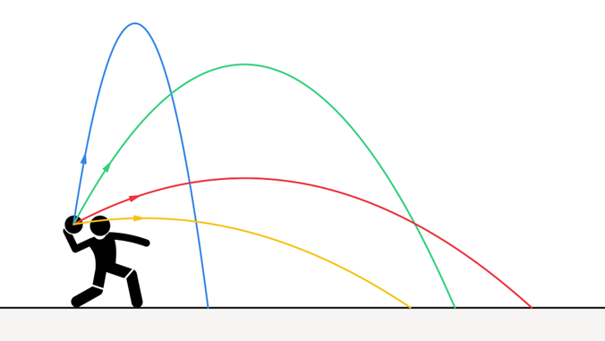
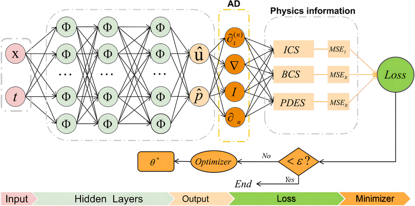
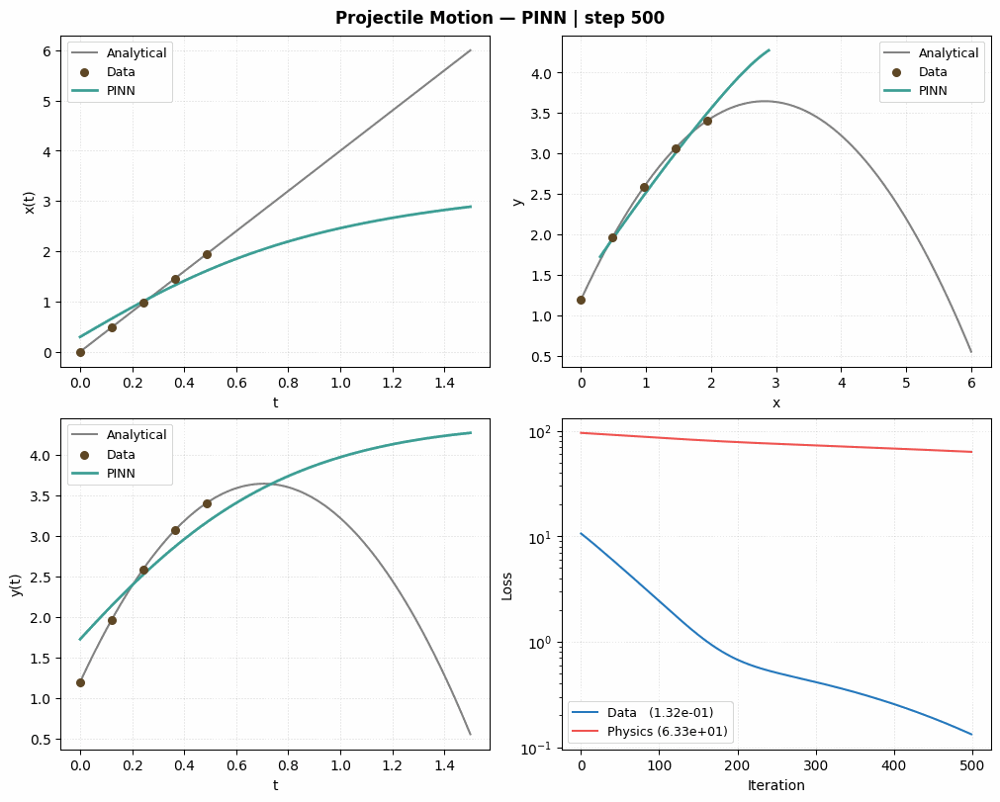

# PINNs Workshop (PyTorch)

A hands-on workshop that builds a Physics-Informed Neural Network (PINN) from scratch in PyTorch, using projectile motion under uniform gravity as the running example.

By the end of this session, you will be able to:

- Explain what a PINN is and why embedding physics into the loss function helps when data is scarce.
- Build a small feedforward network in PyTorch and use `torch.autograd.grad` to compute the second derivatives needed for the ODE residual.
- Combine three loss terms — sparse data, initial conditions, and the governing ODEs — into a single objective and balance their weights.
- Train the network with Adam, monitor the data and physics losses separately, and produce an animation of the learning process.
- Evaluate the trained PINN against the analytical solution and reason about where (and why) it extrapolates well or poorly.

## Overview

PINNs combine data-driven learning with physical constraints. Instead of fitting only observed points, the network is optimized to satisfy both:

- sparse trajectory observations
- the projectile motion ordinary differential equations

For this setup, the equations are:

$$
\frac{d^2x}{dt^2} = 0,\qquad \frac{d^2y}{dt^2} = g
$$

The network predicts horizontal position `x(t)` and vertical position `y(t)` over time.

<p align="center">
  
</p>

## Network architecture

<p align="center">
  
</p>

## Training in action

The PINN gradually learns to satisfy both the sparse data points and the governing ODEs:

<p align="center">
  
</p>

## Requirements

- Python 3.8+
- PyTorch
- Matplotlib
- NumPy
- Pillow (for GIF creation)

Install dependencies:

```bash
pip install torch matplotlib numpy pillow
```

For a build of PyTorch matched to your OS, package manager, and CUDA version, follow the official instructions: [pytorch.org/get-started/locally](https://pytorch.org/get-started/locally/).

## Run

Launch the notebook:

```bash
jupyter notebook Pinns_workshop_with_PyTorch.ipynb
```

## Notes

The trained PINN learns a trajectory close to the analytical solution while respecting physics constraints.

You can experiment with:

- gravity (`g`)
- initial velocity and launch angle
- network size
- number of training epochs